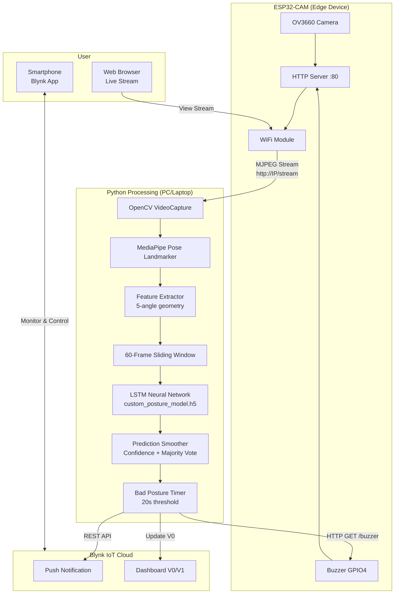
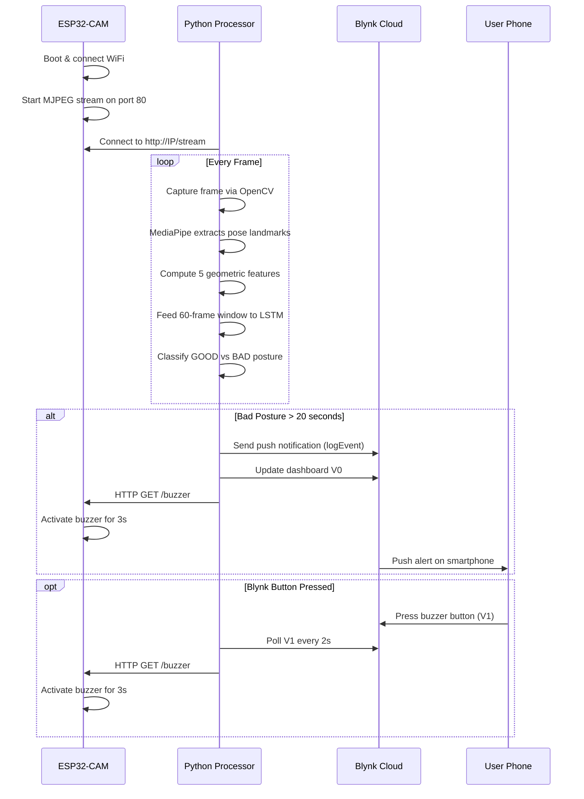
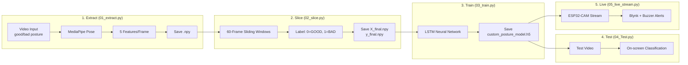

# Sitting Posture Detection System

An IoT-based real-time sitting posture monitoring and alert system using **ESP32-CAM**, **MediaPipe Pose Landmarker**, and a **TensorFlow/Keras LSTM neural network**. The system detects bad sitting posture from a live video stream and triggers alerts via a buzzer and the **Blynk IoT** cloud platform.

---

## Table of Contents

- [System Architecture](#system-architecture)
- [How It Works](#how-it-works)
- [Project Structure](#project-structure)
- [Hardware Requirements](#hardware-requirements)
- [Software Dependencies](#software-dependencies)
- [ML Pipeline](#ml-pipeline)
- [Setup & Installation](#setup--installation)
- [Usage](#usage)
- [Feature Engineering](#feature-engineering)
- [Model Architecture](#model-architecture)
- [Blynk IoT Integration](#blynk-iot-integration)
- [Future Improvements](#future-improvements)

---

## System Architecture



---

## How It Works



---

## Project Structure

```
Sitting_Posture_Detection/
├── platformio.ini                  # PlatformIO config (ESP32-CAM, Arduino framework)
├── pp.py                           # Standalone buzzer test script
├── src/
│   └── main.cpp                    # ESP32-CAM firmware (WiFi, camera, HTTP server, buzzer)
├── Sitting_posture_research/
│   ├── pose_landmarker_lite.task   # MediaPipe pose detection model
│   ├── data/
│   │   ├── X_final.npy             # Training features (N × 60 × 5)
│   │   ├── y_final.npy             # Training labels (N,)
│   │   └── custom/
│   │       ├── good_posture_data.npy
│   │       └── bad_posture_data.npy
│   ├── models/
│   │   ├── posture_model.h5        # (Legacy) original model
│   │   └── custom_posture_model.h5 # Trained LSTM model
│   ├── scripts/
│   │   ├── 01_extract.py           # Step 1: Extract pose features from video
│   │   ├── 02_slice.py             # Step 2: Create 60-frame sliding windows
│   │   ├── 03_train.py             # Step 3: Train LSTM neural network
│   │   ├── 04_Test.py              # Step 4: Test model on recorded video
│   │   └── 05_live_stream.py       # Step 5: Real-time posture detection + Blynk alerts
│   └── videos/                     # Training & test videos (gitignored)
└── .gitignore
```

---

## Hardware Requirements

| Component       | Description                          |
|-----------------|--------------------------------------|
| **ESP32-CAM**   | AI-Thinker ESP32-CAM module          |
| **OV3660**      | 3MP camera (built into ESP32-CAM)    |
| **Buzzer**      | Active/passive buzzer on GPIO 4      |
| **FTDI/USB-TTL**| For programming the ESP32-CAM        |
| **5V Power**    | USB or external 5V supply            |

### ESP32-CAM Pin Mapping (AI-Thinker)

| Signal  | GPIO |
|---------|------|
| XCLK    | 0    |
| SIOD    | 26   |
| SIOC    | 27   |
| Y9–Y2   | 35, 34, 39, 36, 21, 19, 18, 5 |
| VSYNC   | 25   |
| HREF    | 23   |
| PCLK    | 22   |
| PWDN    | 32   |
| **Buzzer** | **4** |

---

## Software Dependencies

### Python (PC-side)

| Package       | Version  | Purpose                          |
|---------------|----------|----------------------------------|
| Python        | ≥ 3.9    | Runtime                          |
| opencv-python | ≥ 4.8    | Video capture & display          |
| mediapipe     | ≥ 0.10   | Pose landmark detection          |
| tensorflow    | ≥ 2.13   | Neural network runtime           |
| keras         | ≥ 3.0    | Model loading & training         |
| numpy         | ≥ 1.24   | Numerical operations             |
| requests      | ≥ 2.31   | Blynk HTTP API calls             |

Install all at once:

```bash
pip install opencv-python mediapipe tensorflow keras numpy requests
```

### PlatformIO (ESP32-CAM)

Defined in `platformio.ini`:

```ini
[env:esp32cam]
platform = espressif32
board = esp32cam
framework = arduino
monitor_speed = 115200
```

---

## ML Pipeline



---

## Setup & Installation

### 1. ESP32-CAM Firmware

```bash
# 1. Open the project in VS Code with PlatformIO installed
# 2. Update WiFi credentials in src/main.cpp:
#    const char* ssid = "YourWiFi";
#    const char* password = "YourPassword";
# 3. Connect ESP32-CAM via FTDI programmer
# 4. Build & upload:
pio run --target upload
# 5. Monitor serial output for IP address:
pio device monitor
```

The ESP32-CAM will serve:
- `http://<IP>/` — Live MJPEG stream viewer page
- `http://<IP>/stream` — Raw MJPEG stream
- `http://<IP>/buzzer` — Trigger buzzer (3-second activation)

### 2. ML Model Training

```bash
cd Sitting_posture_research/scripts

# Step 1: Extract pose features from videos
# (Edit VIDEO_NAME variable for good_posture.mp4 and bad_posture.mp4)
python 01_extract.py

# Step 2: Create 60-frame sliding windows with labels
python 02_slice.py

# Step 3: Train the LSTM model
python 03_train.py
```

### 3. Live Detection

```bash
# Step 4 (optional): Test on recorded video
python 04_Test.py

# Step 5: Run live posture detection
# Update STREAM_URL in 05_live_stream.py with your ESP32-CAM IP
python 05_live_stream.py
```

---

## Feature Engineering

The system extracts **5 geometric features** per frame from 3 body landmarks:

| Landmark | MediaPipe Index | Description      |
|----------|-----------------|------------------|
| Ear      | 7              | Left ear         |
| Shoulder | 11             | Left shoulder    |
| Hip      | 23             | Left hip         |

| Feature | Formula | What It Measures |
|---------|---------|------------------|
| **f1** | `∠(ear_x, 0) → shoulder → ear` | Neck lateral tilt |
| **f2** | `∠(ear → shoulder → hip)` | Torso forward lean (key indicator) |
| **f3** | `∠(shoulder_x, 0) → hip → shoulder` | Hip-shoulder alignment |
| **f4** | `(ear_x − shoulder_x) / torso_length` | Normalized head offset |
| **f5** | `(shoulder_y − ear_y) / torso_length` | Normalized neck compression |

These 5 features form a **60-frame temporal window** (≈ 2 seconds at 30 FPS) that the LSTM uses to classify posture as GOOD or BAD.

---

## Model Architecture

```
Input: (60 timesteps × 5 features)
│
├── LSTM(64, return_sequences=True)
├── BatchNormalization()
├── Dropout(0.3)
├── LSTM(32, return_sequences=True)
├── GlobalAveragePooling1D()
├── Dense(16, activation='relu')
├── Dense(2, activation='softmax')
│
Output: [P(GOOD), P(BAD)]
```

- **Loss**: Sparse Categorical Crossentropy
- **Optimizer**: Adam
- **Epochs**: 40
- **Batch Size**: 32
- **Validation Split**: 20%

### Prediction Smoothing (Live Stream)

To reduce false positives, the live system uses:

1. **Confidence Threshold** (0.75) — Only accept predictions above 75% confidence
2. **Majority Vote** over a 15-prediction sliding window
3. **20-Second Timer** — Bad posture must persist for 20 continuous seconds before alert
4. **60-Second Cooldown** — Prevents rapid re-triggering of alerts

---

## Blynk IoT Integration

The system uses **Blynk IoT Cloud** for remote monitoring and control:

| Virtual Pin | Direction | Purpose |
|-------------|-----------|---------|
| **V0** | PC → Blynk | Posture status display |
| **V1** | Blynk → PC | Manual buzzer trigger button |

### Blynk Events

- **`bad_posture`** event: Push notification sent after 20s of continuous bad posture
- **Dashboard**: Real-time status visible in Blynk mobile/web app

### Configuration

Update `05_live_stream.py`:

```python
BLYNK_AUTH_TOKEN = "your-blynk-token"
STREAM_URL = "http://<ESP32-IP>/stream"
BAD_POSTURE_ALERT_SECONDS = 20
```

---

## Usage

### Quick Test (Buzzer)

```bash
# Edit ESP32_IP in pp.py, then:
python pp.py
```

### Full Live Detection Workflow

1. Power on ESP32-CAM and note its IP from serial monitor
2. Update `STREAM_URL` in `05_live_stream.py`
3. Run: `python Sitting_posture_research/scripts/05_live_stream.py`
4. The window shows:
   - **STATUS**: GOOD (green) or BAD (red)
   - **Confidence**: Model prediction confidence
   - **Angle**: Torso forward lean angle
   - **Alert countdown**: Seconds until alert triggers
5. Press `q` to quit

---

## Future Improvements

- [ ] Add **MQTT** support for more reliable IoT communication
- [ ] Deploy model directly on ESP32-S3 with **TensorFlow Lite Micro**
- [ ] Add **multiple posture classes** (slouching, leaning, twisting)
- [ ] Implement **data logging** with timestamps for posture analytics
- [ ] Add **desktop GUI** with PyQt/Tkinter for non-technical users
- [ ] Support **multiple cameras** for multi-angle posture assessment
- [ ] Integrate with **Apple Health / Google Fit** for wellness tracking
- [ ] Add **voice alerts** via text-to-speech

---

## License

This project is created for academic/research purposes as part of a thesis on posture detection and correction.

---

